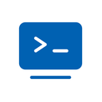

# Focus Guard

<p align="center">
  
</p>

<p align="center">
  <strong>开发者健康助手 - 专为 AI CLI 用户设计的久坐提醒工具</strong>
</p>

<p align="center">
  <a href="https://github.com/huglemon/focus-guard/releases">
    
  </a>
  <a href="https://github.com/huglemon/focus-guard/blob/main/LICENSE">
    
  </a>
  <a href="https://github.com/huglemon/focus-guard/stargazers">
    
  </a>
</p>

<p align="center">
  <a href="./README_EN.md">English</a> | 中文
</p>

---

## 简介

Focus Guard 是一款 macOS 菜单栏应用，专为使用 AI CLI 工具（如 Claude Code、Gemini CLI、Codex 等）的开发者设计。它能智能监控你的工作状态，在适当的时机提醒你站起来活动，保护你的健康。

## 功能特性

- **CLI 进程监控** - 自动检测 Claude Code、Gemini CLI、Codex 等 AI CLI 工具的运行状态
- **智能久坐提醒** - 在 CLI 等待输入时提醒你休息，不打断工作流程
- **声音通知** - CLI 等待输入时播放提示音，避免错过重要交互
- **自动置顶终端** - 智能识别并置顶正确的终端/IDE 窗口
- **多语言支持** - 支持中文和英文界面
- **自动更新** - 内置自动更新功能，始终保持最新版本

## 安装

### 系统要求

- macOS 10.15+
- Apple Silicon (M1/M2/M3)

### 下载安装

1. 前往 [Releases](https://github.com/huglemon/focus-guard/releases) 页面
2. 下载最新版本的 `.dmg` 文件
3. 打开 DMG，将应用拖入 Applications 文件夹
4. 首次运行时，右键点击应用选择"打开"

## 使用方法

### 首次设置

1. **启动应用** - Focus Guard 会在菜单栏显示图标
2. **授予权限** - 根据提示授予以下权限：
   - **通知权限** - 用于发送久坐提醒
   - **输入监控权限** - 用于检测键鼠活动（判断是否站起来休息）

### 菜单栏图标

| 图标颜色 | 状态说明 |
|---------|---------|
| 🟢 绿色 | CLI 正在工作中 |
| 🔴 红色 | CLI 等待你的输入 |
| ⚪ 灰色 | 未检测到 CLI 进程 |

### 功能开关

点击菜单栏图标可以看到以下选项：

- **显示时间** - 在菜单栏显示已坐时长
- **声音通知** - CLI 等待时播放提示音
- **自动置顶终端** - 自动将终端窗口置于最前
- **智能久坐提醒** - 开启/关闭久坐提醒功能
- **提醒间隔** - 设置提醒间隔（20/30/40/50/60 分钟）
- **语言** - 切换中文/英文界面

### 智能久坐提醒逻辑

1. 应用会记录你的连续坐姿时间
2. 当达到设定的提醒间隔时，会在 CLI 等待输入的时机发送提醒
3. 收到提醒后：
   - 如果 2 分钟内无键鼠活动 → 判定为已休息，重置计时
   - 如果仍有键鼠活动 → 继续累计时间

## 隐私声明

Focus Guard 非常重视你的隐私：

### 数据收集

- **不收集任何个人数据** - 应用完全在本地运行
- **不上传任何信息** - 所有数据仅存储在你的设备上
- **不追踪用户行为** - 没有任何分析或追踪代码

### 权限使用说明

| 权限 | 用途 | 数据处理 |
|-----|------|---------|
| 通知权限 | 发送久坐提醒通知 | 仅本地显示，不上传 |
| 输入监控权限 | 检测键鼠活动判断是否休息 | 仅检测有无活动，不记录具体内容 |

### 网络访问

- 应用仅在检查更新时访问 GitHub
- 不会访问任何其他服务器
- 不会发送任何用户数据

## 开发

```bash
# 安装依赖
bun install

# 开发模式
bunx tauri dev

# 构建
bunx tauri build
```

## 技术栈

- **前端**: TypeScript + Vite
- **后端**: Rust + Tauri 2
- **包管理**: Bun

## 开源协议

本项目采用 [MIT License](./LICENSE) 开源协议。

## 作者

**Huglemon**

- 博客: [https://www.huglemon.com](https://www.huglemon.com)
- Twitter: [@huglemon520](https://x.com/huglemon520)
- 即刻: [huglemon](https://okjk.co/zV01gI)

## 致谢

感谢所有使用和支持 Focus Guard 的开发者们！

如果这个项目对你有帮助，欢迎给个 ⭐ Star！

---

<p align="center">
  Made with ❤️ by <a href="https://www.huglemon.com">Huglemon</a>
</p>
